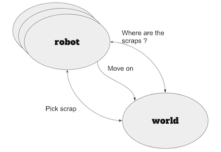

# Scavanging Robots

## Features

- a robot can move forward on the map (advancing on the square in the direction it face)
- a robot can turn left or right
- a robot has a durability score of 10
- a robot can scavange scrap on the map
- the map has a size and is "round" aka a robot moving at the top appears at the bottom and at the left appears at the right (and vice versa)
- a map can have multiple robots
- robots knows where scrap or other robots are due to an old satelitte giving clue :)
- a robot can fight or collaborate with another robot when they meet on the same  square with the following rules:

| Stategy     | Attack | Collaborate |
| ----------- | ------ | ----------- |
| Attack      | -2,-2  | 2,-2        |
| Collaborate | -2,2   | 1,1         |

Inspired by some [Nash equilibrium and game thoery](https://en.wikipedia.org/wiki/Nash_equilibrium#Nash_Equilibrium) :D 

## US

As a robot, I want to move on the world to reach a destination   
As a robot, I want to know where are scraps to pick them  
As a robot, I want to pick scraps to increase my durability

## schema of interaction




## Testing with Property Based Testing

Trying Quixir ? 
https://github.com/pragdave/quixir

## Types
https://stackoverflow.com/questions/39243025/enums-in-elixir  
https://stackoverflow.com/questions/29977776/what-does-type-t-module-mean-in-elixir  
https://elixirschool.com/en/lessons/advanced/typespec/  

## Agent vs GenServer
https://stackoverflow.com/questions/57107324/when-to-use-agent-instead-of-genserver-in-elixir  
https://awochna.com/2017/03/03/elixir-state-management.html  
https://crypt.codemancers.com/posts/2020-08-28-real-world-usecase-for-genserver-agent-in-elixir/  


## Installation

If [available in Hex](https://hex.pm/docs/publish), the package can be installed
by adding `treasure_hunter` to your list of dependencies in `mix.exs`:

```elixir
def deps do
  [
    {:treasure_hunter, "~> 0.1.0"}
  ]
end
```

Documentation can be generated with [ExDoc](https://github.com/elixir-lang/ex_doc)

